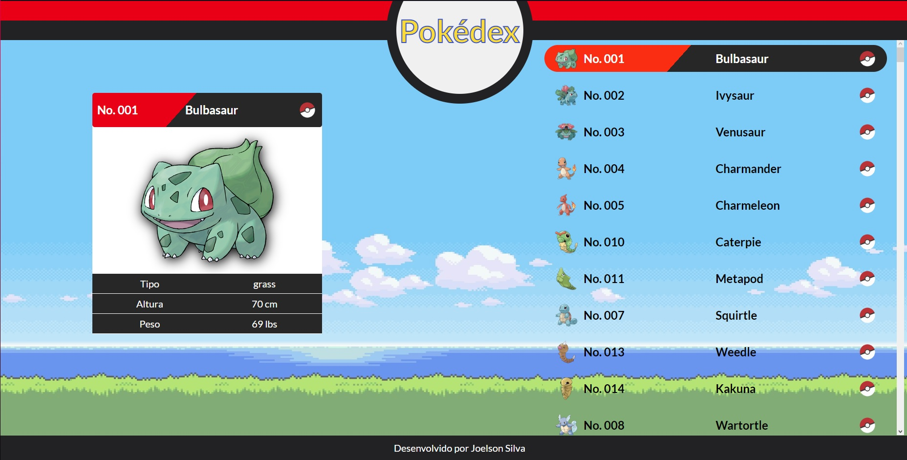

<p align="center">
    Consumindo a PokéAPi
  
</p>

## 🧪 Technologies

Este Projeto foi desenvolvido usando seguintes tecnolias:

- [ReactJS](https://reactjs.org)
- [ViteJS](https://vitejs.dev)
- [Styled Components](https://styled-components.com)

## 🚀 Getting started

Clone o projeto pare ter acessos dos arquivos.

```bash
git clone https://github.com/JoeSeraphy/pokedex-api.git

cd pokedex2.0
```

Run this command to install the dependencies.

```bash
npm install

npm run dev
```

## 🔖 Layout

Você pode visualiza os projetos pelos links abaixo:

- [Live Preview]()

## 📝 License

This project is licensed under the MIT License. See the [LICENSE](LICENSE) file for details.

---

Made with 💜 by [JoeSeraphy]
